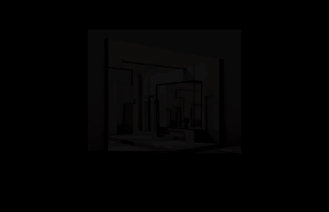

# Video Glitcher



Video Glitcher is a Java app built with Processing as a library. It extends `PApplet`, loads a video file, previews it fullscreen, applies glitch effects in real time, and can export the result as an MP4.

Project site: [krahd.github.io/video_glitcher](https://krahd.github.io/video_glitcher/)

The repository is self-contained and includes the Processing OpenGL jars needed for the `P2D` renderer, plus platform-specific video natives for macOS, Linux, and Windows. Export uses `ffmpeg` from your system `PATH`.

## Releases

Latest release page:

- [GitHub Releases](https://github.com/krahd/video_glitcher/releases)

Latest release downloads:

- [macOS Apple Silicon](https://github.com/krahd/video_glitcher/releases/latest/download/VideoGlitcher-macos-aarch64.zip)
- [Linux x64](https://github.com/krahd/video_glitcher/releases/latest/download/VideoGlitcher-linux-amd64.zip)
- [Windows x64](https://github.com/krahd/video_glitcher/releases/latest/download/VideoGlitcher-windows-amd64.zip)

For version-pinned downloads and release-specific details, open the release page for the tag you want.

## Project Layout

- `src/tom/videoGlitcher/VideoGlitcher.java`: main application source
- `video_glitcher.pde`: original Processing sketch version
- `.vscode/launch.json`: debug launch configs for macOS, Windows, and Linux
- `.vscode/tasks.json`: build and run tasks for VS Code
- `.github/workflows/release.yml`: automated cross-platform release bundles
- `lib/`: bundled Processing, video, ControlP5, and Processing OpenGL libraries
- `bin/`: compiled class output
- `packaging/portable/`: launcher scripts for the portable cross-platform bundle
- `dist/`: generated packaging output, ignored by git

## Requirements

- Java 17 or newer
- VS Code with Java support
- `ffmpeg` on your `PATH` if you want MP4 export
- Native video runtime files are already vendored for `macos-aarch64`, `macos-x86_64`, `linux-amd64`, and `windows-amd64`

## Build

Build from the project root with:

```sh
javac -cp "lib/core.jar:lib/controlP5/library/*:lib/processing-opengl/library/*:lib/video/library/*" -d bin src/tom/videoGlitcher/VideoGlitcher.java src/tom/videoGlitcher/VideoGlitcherLogic.java src/tom/videoGlitcher/FfmpegVideoExporter.java
```

In VS Code, run the default build task:

- `Terminal` -> `Run Build Task...`
- Choose `Build VideoGlitcher`

## Test

Current automated coverage targets the pure Java logic that was extracted from the fullscreen Processing sketch. It covers export filename generation, video-fit calculations, range normalization, glitch state transitions, and ffmpeg export setup.

Run the logic tests from the project root with:

```sh
mkdir -p test-bin && javac -d test-bin src/tom/videoGlitcher/VideoGlitcherLogic.java src/tom/videoGlitcher/FfmpegVideoExporter.java test/tom/videoGlitcher/VideoGlitcherLogicTest.java && java -cp test-bin tom.videoGlitcher.VideoGlitcherLogicTest
```

In VS Code, you can also run:

- `Terminal` -> `Run Task...`
- Choose `Test VideoGlitcher Logic`

### Smoke validation

The app also supports a non-interactive smoke mode for local runtime validation on macOS. Smoke mode runs in a normal window instead of Processing present mode and exits on its own.

Available tasks:

- `Smoke Test VideoGlitcher Startup (macOS Apple Silicon)`
- `Smoke Test VideoGlitcher Load (macOS Apple Silicon)`
- `Smoke Test VideoGlitcher Export (macOS Apple Silicon)`

The load and export smoke tasks generate a short sample clip with `ffmpeg` and launch the app with `--smoke-test`. The load task validates the video pipeline without requiring interaction. The export task exercises the direct ffmpeg-backed export path and exits non-zero if export initialization or frame piping fails.

You can also invoke smoke mode directly from the terminal:

```sh
java -cp "bin:lib/core.jar:lib/controlP5/library/*:lib/processing-opengl/library/*:lib/video/library/*" \
  -Dgstreamer.library.path="$PWD/lib/video/library/macos-aarch64" \
  -Dgstreamer.plugin.path="$PWD/lib/video/library/macos-aarch64/gstreamer-1.0" \
  tom.videoGlitcher.VideoGlitcher --smoke-test --smoke-frames=45
```

To auto-load a file and exercise export:

```sh
java -cp "bin:lib/core.jar:lib/controlP5/library/*:lib/processing-opengl/library/*:lib/video/library/*" \
  -Dgstreamer.library.path="$PWD/lib/video/library/macos-aarch64" \
  -Dgstreamer.plugin.path="$PWD/lib/video/library/macos-aarch64/gstreamer-1.0" \
  tom.videoGlitcher.VideoGlitcher --smoke-test --video=/absolute/path/to/sample.mp4 --auto-export --smoke-frames=180 --export-frames=48
```

The rest of the app still requires manual validation because runtime behavior depends on a fullscreen `PApplet`, native video libraries, and live GUI interaction.

## Run In VS Code

### Task-based run

Use:

- `Terminal` -> `Run Task...`
- Choose `Run VideoGlitcher (macOS Apple Silicon)`

This task builds the app first, then runs it with the correct bundled GStreamer paths.

Additional platform tasks:

- `Build VideoGlitcher (Linux x64)`
- `Run VideoGlitcher (Linux x64)`
- `Build VideoGlitcher (Windows x64)`
- `Run VideoGlitcher (Windows x64)`

### Distribution package

Use:

- `Terminal` -> `Run Task...`
- Choose `Package VideoGlitcher (macOS app)`

This creates a distributable app bundle at `dist/VideoGlitcher.app`.

### Release bundles

Use:

- `Terminal` -> `Run Task...`
- Choose one of:
- `Package VideoGlitcher Release (macOS Apple Silicon)`
- `Package VideoGlitcher Release (Linux x64)`
- `Package VideoGlitcher Release (Windows x64)`

These create release archives in `dist/` for each platform, for example:

- `dist/VideoGlitcher-macos-aarch64.zip`
- `dist/VideoGlitcher-linux-amd64.zip`
- `dist/VideoGlitcher-windows-amd64.zip`

Each bundle contains the application jar, the required libraries, the platform-specific video natives, and the matching launcher script.

### Debug launch

Use:

- `Run and Debug`
- Select one of:
- `Run VideoGlitcher (macOS Apple Silicon)`
- `Run VideoGlitcher (macOS Intel)`
- `Run VideoGlitcher (Linux x64 bundled)`
- `Run VideoGlitcher (Windows x64)`
- Press `F5`

Each debug launch is configured with the correct bundled libraries and native video paths for that platform.

## Run From Terminal

```sh
java -cp "bin:lib/core.jar:lib/controlP5/library/*:lib/processing-opengl/library/*:lib/video/library/*" \
  -Dgstreamer.library.path="$PWD/lib/video/library/macos-aarch64" \
  -Dgstreamer.plugin.path="$PWD/lib/video/library/macos-aarch64/gstreamer-1.0" \
  tom.videoGlitcher.VideoGlitcher
```

## Controls

- Click background: open the file picker when no video is loaded
- `L`: load a video
- `Space`: pause or play
- `G`: turn glitching on or off
- `F`: toggle freeze mode
- `H`: show or hide the HUD
- `U`: show or hide the GUI
- `E`: start or stop export
- `S`: save a frame as PNG
- `Up`: increase glitch intensity
- `Down`: decrease glitch intensity

## Interface Notes

- Clicking inside the GUI does not trigger the background file picker.
- Glitching starts disabled before the first video is loaded so the empty-state text stays readable.
- After the first successful video load, glitching turns on automatically and then follows the user's chosen on/off state.
- If the fitted video does not fill the screen, black mattes are drawn around it so glitches stay confined to the visible video area.
- The sketch runs in Processing present mode so fullscreen covers the macOS menu bar.

## Notes

- The app is written as plain Java, so Processing types that are auto-imported in `.pde` sketches must be imported explicitly in the Java source.
- Video playback depends on the bundled Processing video library and native GStreamer files matching your platform.
- MP4 export depends on `ffmpeg` being installed and available on your `PATH`.
- The macOS packaging task builds an `.app` image with the required jars and bundled Apple Silicon video natives.
- Pushing a release tag like `v1.0.4` triggers the GitHub Actions workflow to build and publish downloadable release bundles for macOS, Linux, and Windows.

## Contributing

Pull requests are welcome.
